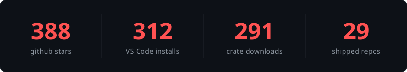
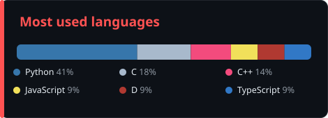

  

  
  
  
  

  
  

### Flagships

| Project | | What it does |
|---------|---|--------------|
| **[go-memory-visualizer](https://github.com/1rhino2/go-memory-visualizer)** | `260*` `312 installs` | VS Code extension: Go struct layout, field padding, and a reorder that shrinks the struct |
| **[RhinoWAF](https://github.com/1rhino2/RhinoWAF)** | `54*` | Go reverse-proxy WAF. Rate limits, JS challenges, sanitization. Runs in front of Traefik/nginx |
| **[fnprint](https://github.com/1rhino2/fnprint)** | `29*` `Rust` | Matches functions across binaries by behavior, not bytes. Survives recompiles and light obfuscation |
| **[unicorn-tci](https://github.com/1rhino2/unicorn-tci)** | `114 dl` | No-JIT unicorn fork so emulation runs with zero executable memory |
| **[pprof-diff](https://github.com/1rhino2/pprof-diff)** | `D` | Diff two Go heap profiles, see what actually grew. [live demo](https://1rhino2.github.io/pprof-diff/) |
| **[persist-scan](https://github.com/1rhino2/persist-scan)** | `C++` | Windows persistence reporter: registry, startup, tasks, services |

  
  
  
  
  
  
  
  
  

  

